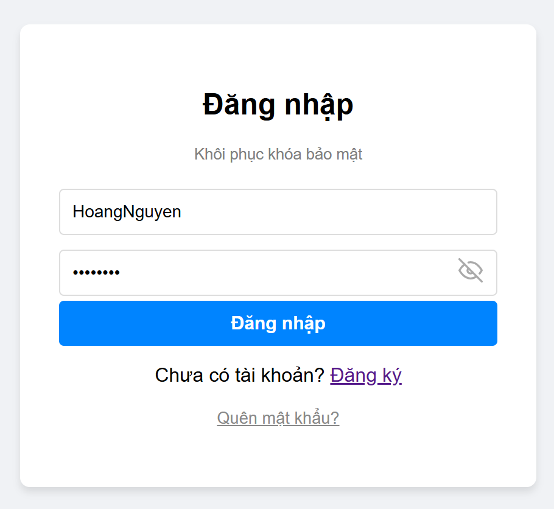
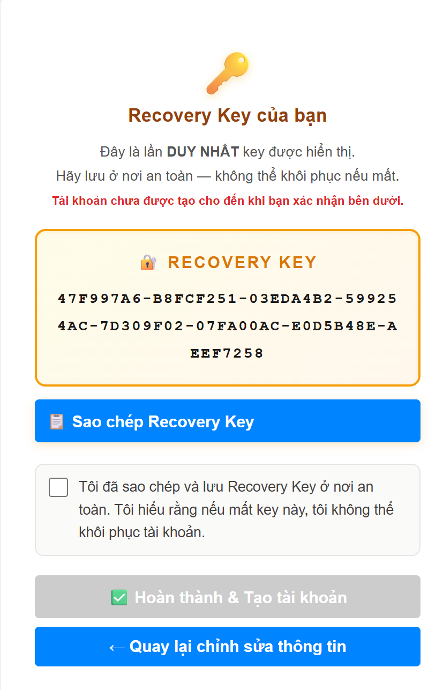
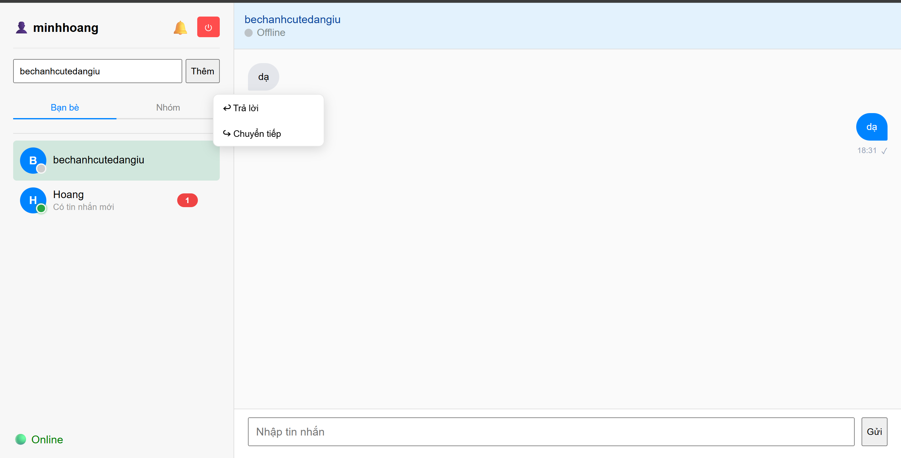
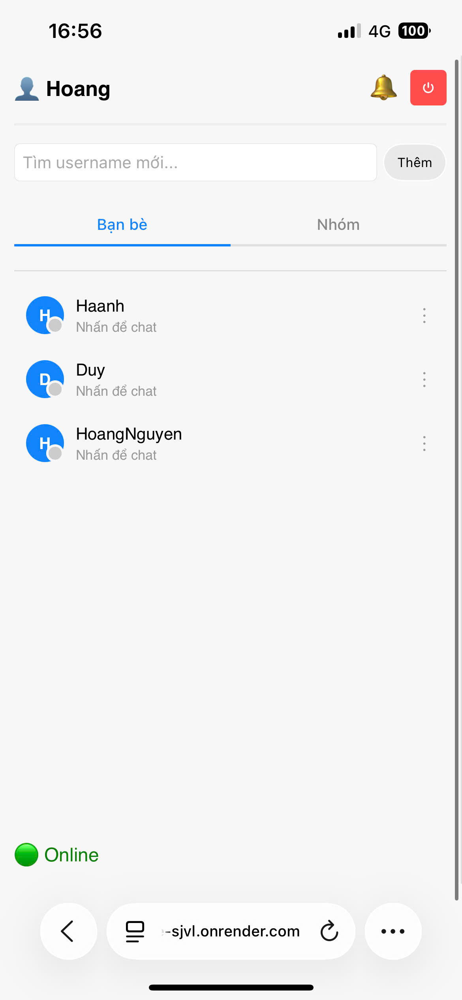
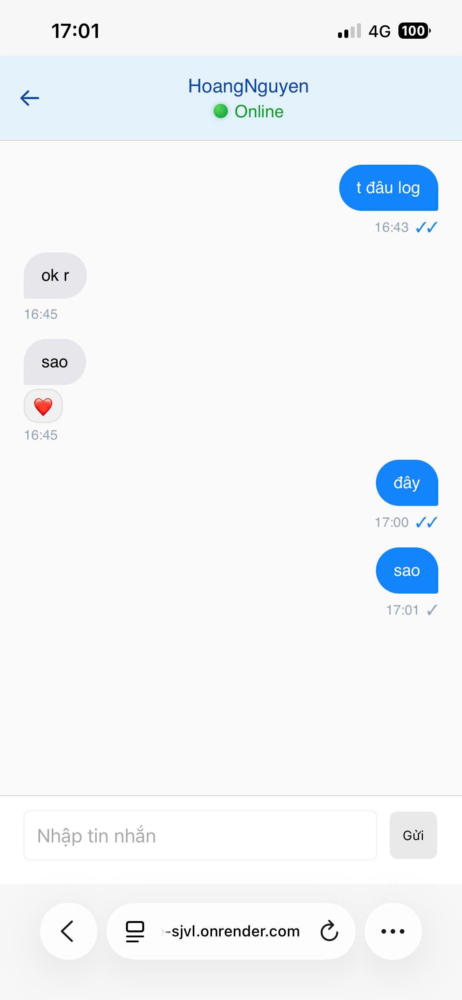
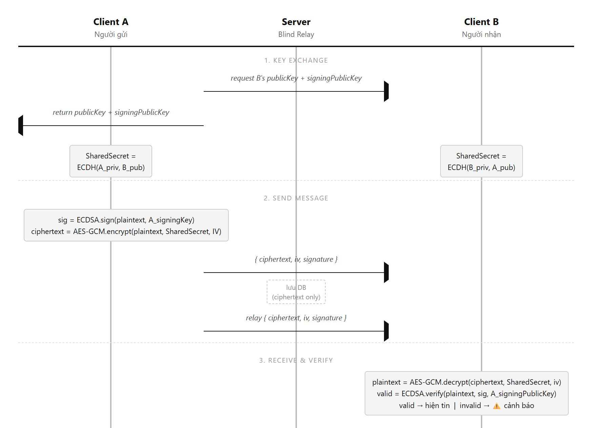

# SecureChat — End-to-End Encrypted Messaging System


> A web-based messaging application built on a **Zero-Knowledge Architecture**. The server acts only as a blind relay and never has access to user passwords, private keys, or plaintext message content. All cryptographic operations occur strictly on the client-side via the **Web Crypto API**.

---

## Demo

### Image Demo Desktop

| Register | Login |
|:---:|:---:|
|||

| Save Recovery Key | Forgot Password |
|:---:|:---:|
|||

| Home Page |
|:---:|
||

---
### Image Demo Mobile

| Sidebar | frame chat |
|:---:|:---:|
|||


### Live Demo (Deploy by Render)

🔗 **[https://chat-e2ee-sjvl.onrender.com](https://chat-e2ee-sjvl.onrender.com/)**

## How It Works



---

## Features

### Core Messaging
- **End-to-End Encryption (E2EE)** — AES-GCM 256-bit with a unique IV per message
- **ECDH Key Exchange** — Shared secret derived entirely on the client, invisible to the server
- **ECDSA Digital Signatures** — Every message is signed before encryption; recipients verify authenticity after decryption. Tampered messages are hidden with a visible warning
- **Real-time Messaging** — Socket.io with auto-reconnect and identity recovery after disconnection
- **Multi-device Sync** — Sending from one device instantly syncs to all other logged-in devices of the same account
- **Persistent Encrypted History** — MongoDB stores only ciphertext; history is decrypted locally on load

### Messaging UX
- **Message Timestamps** — Displayed below each bubble: time only (today), "Hôm qua HH:mm" (yesterday), or full date
- **Read Status** — `✓` (sent) upgrades to `✓✓` in blue when the recipient opens the conversation
- **Unread Badge** — Red count badge per contact in the sidebar, reset automatically when the chat is opened
- **Reply to Message** — Quote any message with a preview bubble; clicking the quote scrolls to the original message
- **Message Reactions** — Toggle emoji reactions (👍❤️😂😮😢😡) on any message; synced real-time to all parties
- **Forward Messages** — Forward to multiple friends or groups simultaneously; content is re-encrypted per recipient
- **Delete Messages** — Sender can permanently delete a message for all parties in real-time
- **Paginated Chat History** — Cursor-based pagination (50 messages/page) for both DM and group chats

### Authentication & Security
- **Zero-Knowledge Authentication** — Server stores only bcrypt hashes; never sees raw passwords or private keys
- **Anti-Enumeration** — Salt endpoint returns deterministic fake salts for non-existent users; login returns unified error messages
- **Domain-Separated Key Derivation** — PBKDF2 uses separate salts (`salt+'auth'` vs `salt+'encrypt'`) to prevent domain-separation attacks
- **Recovery Key** — 32-byte random key generated at registration, shown once. Used to reset the password without losing the private key or chat history
- **JWT Access Token** — Short-lived (15 min), refreshed silently in the background
- **Refresh Token Rotation** — Each refresh revokes the old token and issues a new one, preventing token reuse attacks
- **Refresh Token** — Long-lived (24h), stored in an **HttpOnly cookie** (not accessible by JavaScript) to prevent XSS theft
- **Session Revocation** — All active sessions are invalidated immediately upon password reset
- **Automatic Token Refresh** — `authFetch()` intercepts 401 responses, silently refreshes the token, and retries the original request without interrupting the user

### Social Features
- **Friend Management** — Send, accept, and cancel friend requests with real-time Socket.io notifications
- **Block / Unblock** — Real-time UI update for both parties; blocked users cannot send or receive messages
- **Live Online Status** — Presence tracking via Socket.io connection lifecycle

### Group Chat (E2EE)
- **Encrypted Group Key Distribution** — A 256-bit AES-GCM group key is generated by the creator and individually encrypted for each member using ECDH; the server never sees the plaintext key
- **Group Message History** — All group messages are stored as ciphertext; decrypted locally on load
- **Membership Verification** — Socket.io `join_groups` validates membership via DB query before allowing room access
- **Seen List** — Per-message avatar chips showing which members have read the message; collapses to `+N` when more than 3 viewers
- **Member Management** — Admin can add or remove members; adding a new member triggers admin to re-encrypt the group key for them
- **Persistent System Events** — Join / leave / removal events are saved to the database and displayed as full-width dividers in the chat (survive page reloads)
- **Leave / Dissolve** — Any member can leave; if the last member leaves, the group and all its messages are permanently deleted

### Mobile UI
- **Fixed Viewport** — Uses `100dvh` to lock the layout height so keyboard pop-up on mobile does not resize or push the chat area
- **Sidebar / Chat Panel Navigation** — On screens ≤ 768 px the sidebar and chat area are shown as separate full-screen panels; tapping a contact slides the chat panel in and hides the sidebar
- **Browser Back Button Support** — Opening a chat pushes a History API state entry; pressing the browser back button (or the Android system back gesture) returns to the sidebar without leaving the page
- **Notification Popup Positioning** — The friend-request popup anchors to the right edge of the button (`right: 0`) so it never overflows the screen on narrow viewports
- **Adaptive Chat Header** — Partner name is centred in the header on mobile to account for the back button on the left and the settings button on the right
- **Wider Message Bubbles** — `max-width` for bubbles expands to 85% on mobile for better readability on narrow screens

### Infrastructure
- **Rate Limiting** — 5 failed login attempts per 15 min; 3 password reset attempts per hour; 5 registrations per hour
- **Socket.io Rate Limiting** — Max 10 connections per IP per 30 seconds to prevent reconnect-based DDoS
- **Socket Payload Validation** — All socket events validated for type, size (max 64KB encrypted content), and format
- **Input Validation** — Server-side validation on all auth and chat endpoints via `express-validator`
- **Security Headers** — `helmet` enforces CSP (no `unsafe-inline`), X-Frame-Options, HSTS, and more
- **CORS Middleware** — Configured with credentials support for cross-origin deployments
- **HTTPS Enforcement** — Automatic HTTP→HTTPS redirect in production
- **Health Check** — `GET /health` endpoint returns DB status + uptime for monitoring and load balancers
- **Graceful Shutdown** — SIGTERM/SIGINT handlers close HTTP server → Socket.io → MongoDB in order
- **Structured Logging** — Winston-based JSON logs with rotating files (`logs/combined.log`, `logs/error.log`)
- **Global Error Handling** — Unhandled promise rejections and uncaught exceptions are caught, logged, and handled gracefully

---

## Tech Stack

| Layer | Technology |
|---|---|
| Frontend | HTML5, CSS3, Vanilla JavaScript (ES6 Modules) |
| Cryptography | Web Crypto API — ECDH P-256, ECDSA P-256, AES-GCM, PBKDF2 |
| Backend | Node.js, Express.js |
| Real-time | Socket.io (WebSockets) |
| Database | MongoDB, Mongoose |
| Auth | JWT (jsonwebtoken), bcryptjs, HttpOnly Cookies |
| Security | helmet, cors, express-rate-limit, express-validator |
| Logging | Winston |
| Testing | Jest, Supertest |

---

## Security Architecture

### 1. Zero-Knowledge Registration & Login

```
[Register]
  password + random salt (16 bytes)
        │
        ▼
  PBKDF2 (600,000 iterations, SHA-256)
        │
        ├──▶ encryptionKey (salt+'encrypt') ──▶ AES-GCM encrypt ECDH private key    ──▶ stored
        ├──▶ encryptionKey (salt+'encrypt') ──▶ AES-GCM encrypt ECDSA signing key   ──▶ stored
        └──▶ authKey       (salt+'auth')    ──▶ bcrypt hash                          ──▶ stored

  Recovery Key (32 random bytes)
        ├──▶ AES-GCM encrypt ECDH private key   (backup)           ──▶ stored
        ├──▶ AES-GCM encrypt ECDSA signing key  (backup)           ──▶ stored
        └──▶ bcrypt hash of display string                          ──▶ stored

[Login]
  Same password + salt fetched from server
        │
        ▼
  PBKDF2 re-derives both keys (domain-separated)
        │
        ├──▶ authKey       ──▶ compare with server hash ──▶ issue JWT (15m) + set Refresh Cookie (24h)
        └──▶ encryptionKey ──▶ decrypt private key blob ──▶ stored in IndexedDB only
```

The Private Key is **decrypted client-side** and persisted exclusively in the browser's IndexedDB. It is never re-transmitted to the server after the initial registration.

---

### 2. ECDH Key Exchange

When User A opens a chat with User B:

1. Client A fetches Client B's **ECDH Public Key** and **ECDSA Signing Public Key** from the server
2. Client A computes: `SharedSecret = ECDH(A_privateKey, B_publicKey)`
3. Client B computes: `SharedSecret = ECDH(B_privateKey, A_publicKey)`
4. Both arrive at the **same AES-GCM key** — the server never sees it

---

### 3. Message Encryption & Signing

```
[Send]
  plaintext
     │
     ├──▶ ECDSA sign(plaintext, A_signingPrivateKey)  ──▶ signature (Base64)
     │
     ▼
  AES-GCM encrypt(plaintext, sharedSecret, freshIV)
     │
     ▼
  { encryptedContent, iv, signature } ──▶ server (blind relay) ──▶ recipient

[Receive]
  AES-GCM decrypt(encryptedContent, sharedSecret, iv)  ──▶ plaintext
     │
     ▼
  ECDSA verify(plaintext, signature, B_signingPublicKey)
     │
     ├── valid   ──▶ display message normally
     └── invalid ──▶ hide content, show red warning
```

---

### 4. Recovery Key Flow

```
[Password Reset — client-side only]

  1. User inputs Recovery Key display string
  2. Client imports it as AES-GCM key (high entropy, no PBKDF2 needed)
  3. Client decrypts ECDH & ECDSA private keys from recovery-encrypted bundles
  4. Client generates new salt + derives new encryptionKey from new password
  5. Client re-encrypts both private keys with the new encryptionKey
  6. Client sends new { salt, authKeyHash, encryptedKeys } to server
  7. Server verifies Recovery Key hash (bcrypt), updates credentials,
     and REVOKES ALL active refresh tokens (invalidates all sessions)

  Private keys are never regenerated — chat history remains fully decryptable.
```

---

### 5. Group Chat Key Distribution

```
[Create Group]
  Creator generates AES-GCM 256-bit groupKey (client-side)
        │
        ├──▶ for each member M:
        │       sharedSecret = ECDH(creator_privateKey, M_publicKey)
        │       encryptedGroupKey = AES-GCM encrypt(groupKey, sharedSecret)
        │       ──▶ stored per-member (server sees only ciphertext)
        │
        └──▶ groupKey cached in-memory (Map) on creator's browser

[New Member Added]
  Admin re-encrypts groupKey for new member using ECDH(admin_priv, newMember_pub)
  New member fetches their encrypted blob → decrypts locally → can read all history

[Message Send]
  plaintext ──▶ AES-GCM encrypt(plaintext, groupKey) ──▶ broadcast to group room
  All members decrypt with their local copy of groupKey
```

---

### 6. Zero-Trust API

All protected endpoints extract user identity **exclusively from the verified JWT payload**, never from URL parameters or request body fields. This prevents **IDOR (Insecure Direct Object Reference)** attacks.

The Socket.io `send_message` handler uses `socket.userId` (set at connection time via JWT middleware) rather than trusting any `senderId` field from the client, preventing **WebSocket identity spoofing**.

Socket.io connections are rate-limited (10 per IP per 30s) and all event payloads are validated for type, size, and format before processing.

---

### 7. Token Security

| Property | Access Token | Refresh Token |
|---|---|---|
| Storage | `localStorage` | **HttpOnly Cookie** |
| Lifetime | 15 minutes | 24 hours |
| JS readable | Yes | **No** (XSS-safe) |
| Stored in DB | No | Yes (SHA-256 hash only) |
| Revocable | No (short TTL) | Yes (`revoked` flag) |
| Rotation | — | ✅ New token on each refresh |
| Auto-cleanup | — | MongoDB TTL index |

---

## Database Schema

```
Users
├── username                              (unique)
├── salt                                  (Base64 — for PBKDF2 re-derivation)
├── authKeyHash                           (bcrypt — login verification)
├── publicKey                             (ECDH spki — shared openly)
├── encryptedPrivateKey + iv              (AES-GCM wrapped — server cannot read)
├── signingPublicKey                      (ECDSA spki — shared openly)
├── encryptedSigningPrivateKey + signingIv (AES-GCM wrapped)
├── recoveryKeyHash                       (bcrypt — for password reset verification)
├── encryptedPrivateKeyByRecovery + recoveryIv
├── encryptedSigningPrivateKeyByRecovery + recoverySigningIv
├── createdAt
└── notifications[]
      ├── content
      ├── type
      └── createdAt

Friendships
├── requester    (ObjectId → User)
├── recipient    (ObjectId → User)
├── status       ('pending' | 'accepted' | 'blocked')
└── createdAt
     [unique index on (requester, recipient)]

Messages
├── sender           (ObjectId → User)
├── recipient        (ObjectId → User)
├── encryptedContent (ciphertext only — never plaintext)
├── iv               (AES-GCM IV)
├── signature        (ECDSA Base64 — nullable for legacy messages)
├── read             (Boolean — false until recipient opens the chat)
├── reactions[]      (emoji + userId — one slot per user)
├── replyTo          (messageId, senderName, encryptedContent, iv — nullable)
└── timestamp
     [index on (sender, recipient, timestamp)]
     [index on (recipient, read) — for fast unread count queries]

GroupMessages
├── groupId      (ObjectId → Group)
├── sender       (ObjectId → User)
├── type         ('message' | 'system')
├── systemText   (plain text for system events — nullable)
├── encryptedContent (AES-GCM ciphertext — nullable for system messages)
├── iv
├── signature    (ECDSA Base64 — nullable)
├── readBy[]     (ObjectId[] — members who have opened the chat)
├── reactions[]  (emoji + userId)
├── replyTo      (messageId, senderName, encryptedContent, iv — nullable)
└── timestamp
     [index on (groupId, timestamp)]

Groups
├── name         (max 50 chars)
├── creator      (ObjectId → User)
├── admins[]     (ObjectId[] → User)
├── members[]
│     ├── userId            (ObjectId → User)
│     ├── encryptedGroupKey (AES-GCM wrapped group key)
│     ├── keyIv
│     └── keyHolderId       (who encrypted this slot)
└── createdAt
     [index on members.userId]

RefreshTokens
├── userId       (ObjectId → User)
├── tokenHash    (SHA-256 hex — plaintext never stored)
├── expiresAt    (Date — TTL index auto-deletes expired documents)
├── revoked      (Boolean)
└── createdAt
```

---

## Project Structure

```
CHAT_E2EE/
├── .env.example                          # Template cho env vars (không chứa secrets)
├── package.json
│
├── docs/
│   └── screenshots/                      # Demo screenshots
│
├── src/                                  # Backend (Node.js / Express)
│   ├── app.js                            # Express: middleware, CORS, CSP, health check, routes
│   ├── server.js                         # HTTP server: DB, Socket.io, graceful shutdown
│   │
│   ├── config/
│   │   └── db.js                         # Mongoose connection
│   │
│   ├── models/
│   │   ├── User.js
│   │   ├── Message.js                    # + read, reactions, replyTo fields
│   │   ├── GroupMessage.js               # + type, systemText, readBy, reactions, replyTo
│   │   ├── Group.js                      # per-member encrypted group key
│   │   ├── Friendship.js
│   │   └── RefreshToken.js               # HttpOnly cookie session store
│   │
│   ├── controllers/
│   │   ├── authController.js             # Register, login, refresh (rotation), logout, reset
│   │   ├── chatController.js             # History (paginated), contacts, block, unfriend, reactions
│   │   └── groupController.js            # Group CRUD, member management, group reactions
│   │
│   ├── routes/
│   │   ├── authRoutes.js
│   │   ├── chatRoutes.js
│   │   └── groupRoutes.js
│   │
│   ├── socket/                           # Socket.io handlers — split by domain
│   │   ├── index.js                      # Rate limiting + JWT auth + handler registration
│   │   ├── presenceHandler.js            # join_user, disconnect, online status
│   │   ├── messageHandler.js             # send_message (validated), mark_read, reactions
│   │   ├── friendHandler.js              # send/accept friend request, clear notification
│   │   └── groupHandler.js              # send_group_message (validated), join_groups (verified)
│   │
│   ├── services/
│   │   ├── authService.js                # signAccessToken, issueRefreshToken, revokeAllSessions
│   │   └── groupService.js               # isAdmin, isMember, isCreator helpers
│   │
│   ├── middleware/
│   │   ├── authMiddleware.js             # JWT verify, TOKEN_EXPIRED code for auto-refresh
│   │   ├── rateLimiter.js                # Per-route rate limits (login / register / reset)
│   │   ├── requestLogger.js              # HTTP request logging middleware
│   │   └── validators/                   # express-validator schemas — split by domain
│   │       ├── index.js                  # Re-exports all validators
│   │       ├── common.js                 # Shared: validateUsername, validateRecoveryKey
│   │       ├── authValidators.js         # loginValidation, registerValidation, resetValidation
│   │       ├── chatValidators.js         # targetIdValidation
│   │       └── groupValidators.js        # createGroup, addMember, removeMember validators
│   │
│   ├── utils/
│   │   ├── logger.js                     # Winston structured logger
│   │   ├── crypto.js                     # hashToken, hashPassword, verifyPassword helpers
│   │   ├── onlineUsers.js                # Encapsulated presence module (replaces global Map)
│   │   └── socketValidator.js            # Socket payload validation helper + schemas
│   │
│   └── __tests__/                        # Test suite — 210 tests, 9 suites
│       ├── unit/
│       │   ├── crypto.test.js            # 23 tests — hashToken, bcrypt, generateRefreshToken
│       │   ├── authMiddleware.test.js     # 9 tests — JWT valid/expired/invalid/missing
│       │   └── validators.test.js        # 26 tests — all validation rules end-to-end
│       ├── integration/
│       │   ├── authController.test.js     # 28 tests — register, login, refresh rotation, recovery
│       │   ├── chatController.test.js     # 24 tests — paginated history, contacts, IDOR, reactions
│       │   └── groupController.test.js    # 29 tests — createGroup, member ops, reactions, seen
│       ├── api/
│       │   ├── auth.routes.test.js       # 29 tests — full pipeline: route → validator → controller
│       │   ├── chat.routes.test.js       # 19 tests — authMiddleware on every route, IDOR check
│       │   └── group.routes.test.js      # 23 tests — routing + auth guard on all endpoints
│       └── helpers/
│           ├── db.js                     # Test DB helper (stub)
│           └── fixtures.js               # Factory functions for fake users, tokens, groups
│
└── public/                               # Frontend (Vanilla JS ES Modules)
    ├── index.html
    ├── login.html
    ├── register.html
    ├── forgot-password.html
    ├── styles/                           # Modular CSS (split from single main.css)
    │   ├── base.css                      # Body reset, layout, utilities
    │   ├── auth.css                      # Login, register, forgot-password, recovery key panel
    │   ├── sidebar.css                   # Sidebar, contacts, tabs, profile, menus
    │   ├── chat.css                      # Chat area, messages, emoji, reactions, reply
    │   ├── modal.css                     # All modal dialogs, member lists
    │   └── responsive.css                # Mobile breakpoints (≤768px)
    └── js/
        ├── app.js                        # Entry point: init, DOM event listeners only (~120 lines)
        ├── state.js                      # Single source of truth for all client-side state
        ├── utils.js                      # authFetch, logout, loadKeyFromDB, formatTime
        ├── api.js                        # All HTTP API calls: loadContacts, loadChatHistory, loadGroups
        ├── actions.js                    # User actions: sendMessage, deleteMessage, toggleReaction, forward
        ├── login.js
        ├── register.js
        ├── forgot-password.js
        ├── password-toggle.js            # Hold-to-reveal password toggle (SVG eye icon)
        ├── crypto/
        │   ├── key-manager.js            # All Web Crypto API operations (ECDH, ECDSA, AES-GCM, PBKDF2)
        │   └── groupCrypto.js            # Group key: encryptForMember, decryptGroupKey, getGroupKey
        ├── socket/
        │   ├── dmSocket.js               # DM + friend + presence socket event handlers
        │   └── groupSocket.js            # Group socket event handlers
        └── ui/
            ├── dom.js                    # Centralized DOM element references
            ├── messageUI.js              # appendMessage, reactions, emoji picker, reply bar, seen
            ├── contactUI.js              # renderContactItem, badges, notification popup, block
            ├── groupUI.js                # renderGroupItem, openGroupChat, create/manage modals
            └── forwardModal.js           # Forward message modal
```

---

## Installation & Setup

### Prerequisites
- Node.js v18+
- MongoDB (local or Atlas)

### Steps
```bash
# 1. Clone the repository
git clone <repo-url>
cd chat_e2ee

# 2. Install dependencies
npm install

# 3. Create .env file
cp .env.example .env
# Fill in: MONGO_URI, SESSION_SECRET, FRONTEND_URL

# 4. Start the server
npm run dev      # development (nodemon)
npm start        # production
```

### `.env.example`

```env
# Server
PORT=3000
NODE_ENV=development

# MongoDB connection string
MONGO_URI=mongodb+srv://<user>:<password>@<cluster>.mongodb.net/?appName=<appName>

# JWT signing secret (generate: node -e "console.log(require('crypto').randomBytes(64).toString('hex'))")
SESSION_SECRET=

# Frontend URL for CORS
FRONTEND_URL=http://localhost:3000

# Logging level (error, warn, info, debug)
LOG_LEVEL=info
```

### Environment Variables

| Variable | Required | Description |
|---|---|---|
| `MONGO_URI` | ✅ | MongoDB connection string |
| `SESSION_SECRET` | ✅ | JWT signing secret (64+ random bytes recommended) |
| `FRONTEND_URL` | ✅ | Frontend URL for CORS (e.g., `http://localhost:3000`) |
| `PORT` | ❌ | Server port (default: 3000) |
| `NODE_ENV` | ❌ | `production` enables HTTPS redirect |
| `LOG_LEVEL` | ❌ | Winston log level (default: `info`) |

---

## API Endpoints

### Authentication
| Method | Endpoint | Description |
|---|---|---|
| `GET`  | `/api/auth/check-username/:username` | Check if a username already exists |
| `POST` | `/api/auth/register` | Create a new account |
| `POST` | `/api/auth/login` | Authenticate and issue tokens |
| `POST` | `/api/auth/refresh` | Refresh token (with rotation) |
| `POST` | `/api/auth/logout` | Revoke refresh token and log out |
| `GET`  | `/api/auth/salt?username=` | Get salt for PBKDF2 derivation |
| `POST` | `/api/auth/verify-recovery` | Verify recovery key (step 1 of reset) |
| `POST` | `/api/auth/reset-password` | Reset password using recovery key |

### Chat
| Method | Endpoint | Description |
|---|---|---|
| `GET`  | `/api/chat/history/:partnerId?before=&limit=` | Paginated chat history (cursor-based) |
| `GET`  | `/api/chat/contacts` | List all contacts with online status |
| `GET`  | `/api/chat/requests` | Pending friend requests |
| `GET`  | `/api/chat/notifications` | User notifications |
| `POST` | `/api/chat/unfriend` | Remove a friend |
| `POST` | `/api/chat/block` | Block a user |
| `POST` | `/api/chat/unblock` | Unblock a user |
| `POST` | `/api/chat/message/delete` | Permanently delete a message |
| `POST` | `/api/chat/message/reaction` | Toggle emoji reaction |

### Groups
| Method | Endpoint | Description |
|---|---|---|
| `POST` | `/api/groups/create` | Create a new group |
| `GET`  | `/api/groups` | List user's groups |
| `GET`  | `/api/groups/:groupId/history?before=&limit=` | Paginated group message history |
| `GET`  | `/api/groups/:groupId/info` | Group info and member list |
| `GET`  | `/api/groups/:groupId/my-key` | Get encrypted group key for current user |
| `GET`  | `/api/groups/member-keys?userIds=` | Public keys for group members |
| `POST` | `/api/groups/:groupId/add-member` | Add a member (admin only) |
| `POST` | `/api/groups/:groupId/remove-member` | Remove a member (admin only) |
| `POST` | `/api/groups/:groupId/leave` | Leave the group |
| `POST` | `/api/groups/message/delete` | Delete a group message |
| `POST` | `/api/groups/message/reaction` | Toggle emoji reaction on group message |

### Infrastructure
| Method | Endpoint | Description |
|---|---|---|
| `GET` | `/health` | Health check (DB status + uptime) |

---

## Running Tests

The test suite covers **210 tests across 9 suites** on 3 levels: Unit, Integration, and API.

```bash
# Run all tests
npm test

# Run by level
npm run test:unit         # crypto, authMiddleware, validators
npm run test:integration  # authController, chatController, groupController
npm run test:api          # auth routes, chat routes, group routes

# With coverage report
npm run test:coverage
```

### Test coverage breakdown

| Level | Suites | Tests | What is covered |
|---|---|---|---|
| Unit | 3 | 58 | `crypto.js` helpers, JWT middleware branches, all validator rules |
| Integration | 3 | 81 | Controller logic + IDOR protection + security invariants (via jest.mock) |
| API | 3 | 71 | Full request pipeline: route → validator → authMiddleware → controller |
| **Total** | **9** | **210** | |

Key security assertions verified by tests:
- `authKeyHash` and `recoveryKeyHash` are always bcrypt-hashed before saving (never stored as plaintext)
- `refreshToken` is stored in DB as SHA-256 hash only (plaintext lives only in the HttpOnly cookie)
- **Refresh token rotation**: old token is revoked, new cookie is issued on each refresh
- After password reset, **all** active refresh tokens are revoked (`revoked: true`)
- IDOR: `deleteMessage` returns 403 when called by the recipient instead of the sender
- `userId` in every protected endpoint comes from the verified JWT, never from request body
- Anti-enumeration: salt endpoint returns 200 for non-existent users, login returns unified 401

---

## Known Limitations

- **No forward secrecy** — Compromise of a long-term ECDH private key allows decryption of all past and future messages encrypted with that key pair. Implementing a Double Ratchet protocol (like Signal) would mitigate this.
- **No message deletion for recipients** — Only the sender can delete a message; recipient-side deletion is not yet implemented
- **No media support** — Text messages only; file and image sharing are not supported
- **No message editing** — Sent messages cannot be edited; only deletion is supported
- **Single recovery key** — The recovery key is shown once at registration and cannot be regenerated without resetting the password

---

## License

This project is licensed under the [MIT License](LICENSE).

---

## Author

**Nguyen Tran Minh Hoang** — Full-stack Developer